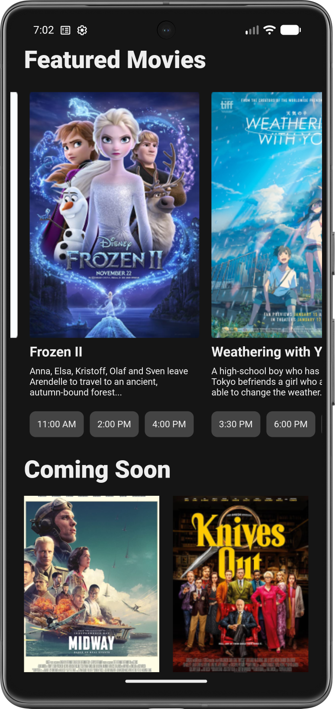
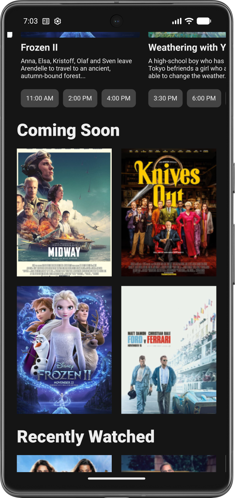
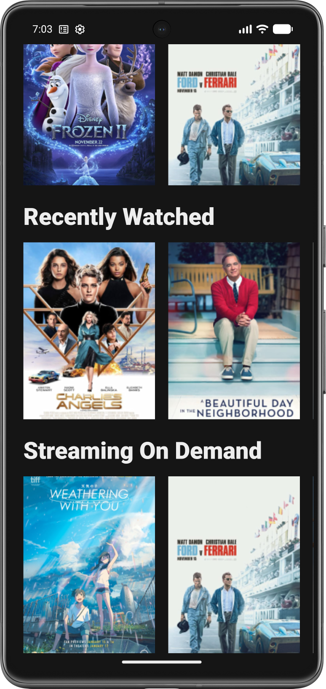

# 🎬 Кинотеатр – UI-концепт

Современный UI-прототип приложения для киноманов. Один экран объединяет афишу сеансов, ожидаемые премьеры, историю просмотров и стриминговые подборки. Всё на Jetpack Compose с плавными анимациями.

---

## ✨ Что внутри экрана

- **🎥 Список фильмов с сеансами (LazyRow)** – горизонтальная лента фильмов, на которые можно купить билеты прямо сейчас. Для каждого отображается постер, название и ближайшие сеансы.
- **🚀 Скоро выйдут (FlowRow)** – облако из карточек ожидаемых новинок. Адаптивный макет: карточки переносятся по строкам в зависимости от ширины экрана.
- **🕒 Последние просмотренные (HorizontalPager)** – свайпабельная галерея фильмов, которые пользователь недавно смотрел. Каждый фильм показывает прогресс просмотра.
- **📺 Streaming (HorizontalPager)** – ещё один пейджер с подборками фильмов, доступных на стриминговых платформах (Netflix, Кинопоиск и др.).

---

## 🛠 Технологический стек

---

## 🎥 Демонстрация

  
   
  <em>Прокрутка афиши и перелистывание пейджеров</em>

---

## 📸 Скриншоты

| Сеансы | FlowRow «Скоро» | HorizontalPager (просмотренные) |
| :---------------------: | :-------------: | :-----------------------------: |
|  |  |  |

---

## 🧱 Особенности реализации

- **Полностью на Compose** – все элементы UI построены без XML.
- **LazyRow** используется для горизонтального списка фильмов с сеансами. Каждый элемент — карточка с постером и временем сеансов.
- **FlowRow** для адаптивного облака «Скоро выйдут». Карточки выстраиваются слева направо с переносом.
- **HorizontalPager** для просмотренных и стриминговых подборок.
- **Данные** – заглушки: списки фильмов, постеры (из локальных ресурсов), время сеансов, названия стримингов.
- **Состояние** управляется через `mutableStateListOf` и `mutableIntStateOf` для пейджеров.

---

## 🚀 Быстрый старт

1. Перейдите в раздел [**Releases**](https://github.com/kerikir/MovieTheater/releases).
2. Скачайте APK-файл (`MovieTheater.apk`).
3. **Установка:**
   - Откройте загруженный файл на устройстве Android.
   - При необходимости разрешите установку из неизвестных источников.
   - Завершите установку.
4. Запустите «MovieTheater» и изучайте интерфейс.

> ℹ️ Приложение создано исключительно для демонстрации UI. Все данные статичны, навигация не ведёт к другим экранам.

